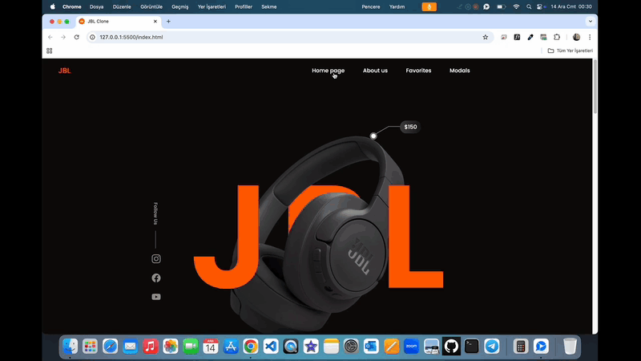

# JBL Clone WebSite 🎧

<li>Bu proje HTML5,SCSS ile oluşturulmuş JBL Clone WebSite site arayüzü içerir.</li>
<li>SCSS ile modüller oluşturularak proje yönetimi kolaylaştırılmıştır. </li>
<li>Sade ve modern yapısı ile kullanıcı dostu arayüzüne sahiptir. </li>
<li>Ayrıca duyarlı tasarımı ile telefon,tablet,bilgisayar üzerinden kolay erişim olanağı sunar.</li>

# Kullanılan Teknolojiler 🎨

<li>HTML5</li>
<li>SCSS</li>
<li>Responsive Design</li>

# Ekran Görüntüsü 🎥
      

# İletişim 📩
yunusemreoral@hotmail.com.tr

